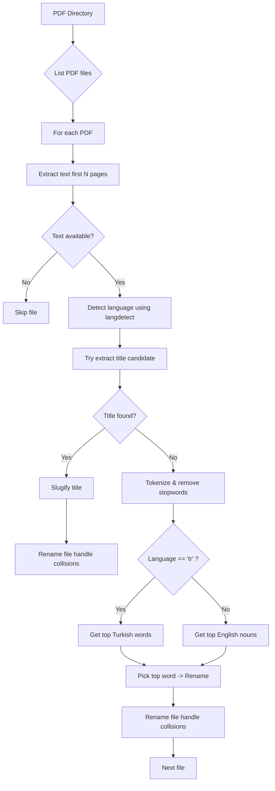
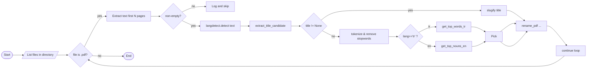

# Architecture & Technical Review

This document provides a concise technical review of the repository from three perspectives: senior
software developer, software architect, and product manager. It explains the code structure, key
algorithms, dataflow of the PDF renaming tool, critical code blocks, risks, and prioritized
improvements. Diagrams are included as Mermaid blocks so they render in tools that support them.

Repository snapshot
- Primary purpose: a small CLI utility that inspects PDFs in a directory and renames files based on
  an extracted title or fallback keywords.
- Key files: `pdf_renamer.py`, `main.py`, `pyproject.toml`, `AGENTS.md`.
- Notable gaps: no tests, no packaging build-system in `pyproject.toml`, NLTK downloads at import
  time, `print()` used instead of structured logging.

1) High-level architecture

- Single-module tool: most logic lives in `pdf_renamer.py`. `main.py` is a trivial entrypoint.
- Runtime dependencies: `langdetect`, `nltk`, `pypdf2`, `tqdm` (declared in `pyproject.toml`).

Mermaid - high level dataflow



2) Component breakdown

- `pdf_renamer.py` — contains all logic. Key functions:
  - `extract_text_from_pdf(pdf_path, max_pages=3)` — reads first pages and concatenates text.
  - `extract_title_candidate(pdf_path, max_pages=3)` — heuristic to find a probable title.
  - `clean_and_tokenize(text, lang)` — lowers, strips punctuation, tokenizes, filters stopwords.
  - `get_top_nouns_en(words, n=4)` / `get_top_words_tr(words, n=4)` — frequency / POS heuristics.
  - `slugify(text, lang)` — filename-safe transformation.
  - `rename_pdf(pdf_path, new_name, directory)` — handles name collisions and renames.
  - `main(directory, max_pages=3)` — orchestrates the flow and uses `tqdm` for progress.

- `main.py` — tiny script that calls `main()` for a default directory (`./pdfs`).

3) Critical code blocks and explanations

- Text extraction (robustness concerns)

```python
def extract_text_from_pdf(pdf_path, max_pages=3):
    """Extract raw text from a given number of starting pages."""
    text = ""
    try:
        reader = PdfReader(pdf_path)
        num_pages = min(len(reader.pages), max_pages)
        for i in range(num_pages):
            text += reader.pages[i].extract_text() or ""
    except Exception as e:
        print(f"Error reading {pdf_path}: {e}")
    return text
```

Notes:
- `PdfReader.extract_text()` can return `None` for scanned/PDF-as-image files — OCR is required in
  those cases (e.g., `pytesseract` + `pdf2image`).
- Catching `Exception` is acceptable for a CLI tool, but use `logging.exception(...)` and consider
  finer-grained handling for different PdfReader errors.

- Title extraction heuristic

```python
def extract_title_candidate(pdf_path, max_pages=3):
    # collect lines from first pages, prefer the first sufficiently long non-uppercase line
    # fallback to the longest line
```

Notes:
- Heuristic is pragmatic but brittle: many PDFs include multi-column layouts, headers/footers, or
  author/title blocks in metadata rather than as a clear isolated line. Consider checking
  `reader.metadata` (`PdfReader.metadata`) and/or using layout-aware extraction.

- Tokenization and stopword handling

```python
def clean_and_tokenize(text, lang):
    text = text.lower()
    text = re.sub(f"[{re.escape(string.punctuation)}]", " ", text)
    words = word_tokenize(text)
    if lang == 'tr':
        stop_words = set(stopwords.words('turkish')).union(custom_stopwords_tr)
    else:
        stop_words = set(stopwords.words('english')).union(custom_stopwords_en)
    words = [w for w in words if w.isalpha() and w not in stop_words and len(w) > 3]
    return words
```

Notes:
- NLTK corpora (`punkt`, `stopwords`, `averaged_perceptron_tagger`) are required before using
  tokenization/POS. Currently these are downloaded at import-time in the module which is a side
  effect that can cause long delays and network I/O. Move downloads to a setup step or guard them
  behind `if __name__ == '__main__'` or a `setup_nltk()` helper.

- Renaming and collision handling

```python
def rename_pdf(pdf_path, new_name, directory):
    ext = ".pdf"
    new_filename = f"{new_name}{ext}"
    new_filepath = os.path.join(directory, new_filename)
    i = 1
    while os.path.exists(new_filepath):
        new_filename = f"{new_name}_{i}{ext}"
        new_filepath = os.path.join(directory, new_filename)
        i += 1
    os.rename(pdf_path, new_filepath)
    print(f"Renamed to: {new_filename}")
```

Notes:
- Collisions are handled with an incremental suffix — simple and effective.
- Use `pathlib.Path` for clearer path manipulation and to reduce platform differences.
- Consider an atomic rename with error handling for permission issues.

4) Dataflow detail (step-by-step)



5) Strengths & weaknesses (product/architecture view)

Strengths:
- Small, focused codebase — easy to reason about and extend.
- Pragmatic heuristics to get useful filenames without user input.

Weaknesses / Risks:
- No tests — difficult to maintain and validate changes.
- NLTK downloads during import create side effects and slow startup.
- Reliance on text extraction without OCR means scanned PDFs are skipped silently.
- No CLI options (dry-run, verbose, pattern include/exclude, max_pages) — UX could be improved.
- No logging or error visibility beyond `print()`.

6) Recommendations (prioritized)

1. Move NLTK downloads out of module import and add a `setup_nltk()` helper or document a setup step
   in README/AGENTS.md (high priority).
2. Replace `print()` with `logging` and add a `--verbose` flag to the CLI (medium priority).
3. Add unit tests for `extract_text_from_pdf`, `slugify`, `extract_title_candidate` (use fixtures
   and mocks) and set up `pytest` (high priority).
4. Add a small CLI parser (argparse) to accept `--dir`, `--dry-run`, `--max-pages`, `--skip-ocr`.
5. Consider optional OCR pipeline for scanned PDFs (integrate `pdf2image` + `pytesseract`) or
   detect and surface skipped files.
6. Use `pathlib.Path`, add type hints to public functions, and add pre-commit hooks (Black, isort,
   ruff).

7) Small implementation suggestions and examples

- Move NLTK downloads into a helper (example):

```python
def ensure_nltk_data():
    import nltk
    try:
        nltk.data.find('tokenizers/punkt')
    except LookupError:
        nltk.download('punkt')
    # repeat for other corpora

if __name__ == '__main__':
    ensure_nltk_data()
    main('./pdfs')
```

- Use `logging` instead of `print()`:

```python
import logging
logger = logging.getLogger(__name__)
logger.info('Renamed to: %s', new_filename)
```

8) Suggested roadmap (next 6 steps)

1. Add `ensure_nltk_data()` and remove `nltk.download(...)` from top-level import.
2. Add `pytest` + tests for core functions. Mock `PdfReader` to avoid shipping sample PDFs.
3. Add basic CLI (`argparse`) with `--dir`, `--dry-run`, `--max-pages`, `--verbose`.
4. Replace `os.path` with `pathlib.Path` (small refactor across `pdf_renamer.py`).
5. Add pre-commit config and run `black`, `isort`, `ruff`.
6. Optionally prototype OCR support for scanned PDFs and a `--ocr` flag.

9) File map (quick reference)

- `pdf_renamer.py` — main implementation and orchestration
- `main.py` — tiny CLI wrapper
- `pyproject.toml` — metadata and runtime deps
- `AGENTS.md` — guidance for automated agents (added earlier)
- `docs/ARCHITECTURE.md` — this document

10) Closing notes (product view)

This project is a high-leverage utility: a small investment (move NLTK downloads, add tests, and
introduce logging/CLI) will dramatically improve developer experience and reliability. From a
product perspective, consider making the rename process reversible (store a log mapping old->new),
and adding a preview/dry-run mode so users can validate results before renaming many files.

If you want, I can implement the top two items (1. move NLTK downloads to a guarded helper, 2.
add a minimal `pytest` test scaffold for `slugify` and `rename_pdf`) next — which should take a few
small, focused commits.
