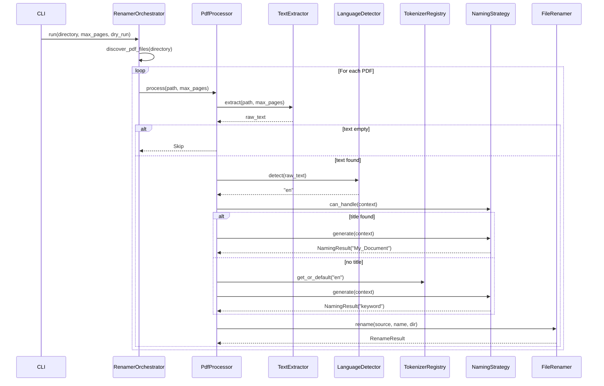

# SOLID Refactoring Plan: PDF Renaming Tool

## Executive Summary

This plan transforms the monolithic `pdf_renamer.py` (155 lines, 10 functions, 0 classes) into a modular architecture following SOLID principles. The goal is maintainability and extensibility without changing external behavior.

---

## 1. Current SOLID Violations

| Principle | Violation | Impact |
|-----------|-----------|--------|
| **SRP** | One module handles extraction, detection, tokenization, naming, file I/O | Any change risks breaking unrelated features |
| **OCP** | Adding German requires modifying `clean_and_tokenize()` and adding `get_top_nouns_de()` | Must modify existing code |
| **LSP** | No abstractions exist; cannot swap `PyPDF2` for `pdfplumber` | Tight library coupling |
| **ISP** | Importing `pdf_renamer` gives all 10 functions even if only `slugify` is needed | Unnecessary coupling |
| **DIP** | Hard-coded: `from PyPDF2 import PdfReader`, `from langdetect import detect` | Cannot inject test doubles |

---

## 2. Target Module Structure

```
src/pdf_renamer/
    __init__.py                  # Public API
    models.py                    # PdfDocument, RenameResult, RenamerConfig

    extraction/
        base.py                  # TextExtractor (ABC)
        pdf.py                   # PdfTextExtractor

    language/
        detector.py              # LanguageDetector (ABC) + LangdetectDetector

    tokenization/
        base.py                  # Tokenizer (ABC)
        english.py               # EnglishTokenizer (POS-based)
        turkish.py               # TurkishTokenizer (frequency-based)
        registry.py              # TokenizerRegistry (OCP: add via register())

    naming/
        base.py                  # NamingStrategy (ABC)
        title.py                 # TitleNamingStrategy
        keyword.py               # KeywordNamingStrategy
        slugifier.py             # Slugifier

    processing/
        renamer.py               # FileRenamer (collision handling)
        pipeline.py              # PdfProcessor (single-file workflow)

    orchestrator.py              # RenamerOrchestrator (batch)
    container.py                 # Dependency wiring

cli/app.py                       # argparse CLI
main.py                          # Thin entrypoint
```

---

## 3. Target Architecture Diagram

```mermaid
graph TB
    subgraph "CLI Layer"
        CLI[cli/app.py<br/>argparse + logging]
    end

    subgraph "Orchestration"
        ORCH[RenamerOrchestrator]
        PIPE[PdfProcessor]
    end

    subgraph "Domain: Extraction"
        EXT_BASE[TextExtractor ABC]
        EXT_PDF[PdfTextExtractor]
    end

    subgraph "Domain: Language"
        LANG_BASE[LanguageDetector ABC]
        LANG_IMPL[LangdetectDetector]
    end

    subgraph "Domain: Tokenization"
        TOK_BASE[Tokenizer ABC]
        TOK_EN[EnglishTokenizer]
        TOK_TR[TurkishTokenizer]
        TOK_REG[TokenizerRegistry]
    end

    subgraph "Domain: Naming"
        NAME_BASE[NamingStrategy ABC]
        NAME_TITLE[TitleStrategy]
        NAME_KW[KeywordStrategy]
        SLUG[Slugifier]
    end

    subgraph "Domain: File I/O"
        RENAMER[FileRenamer]
    end

    CLI --> ORCH
    ORCH --> PIPE
    PIPE --> EXT_BASE
    PIPE --> LANG_BASE
    PIPE --> TOK_REG
    PIPE --> NAME_BASE

    EXT_BASE <|-- EXT_PDF
    LANG_BASE <|-- LANG_IMPL
    TOK_BASE <|-- TOK_EN
    TOK_BASE <|-- TOK_TR
    TOK_REG --> TOK_BASE
    NAME_BASE <|-- NAME_TITLE
    NAME_BASE <|-- NAME_KW
```

---

## 4. Key Interface Definitions

### 4.1 TextExtractor (OCP + LSP)

Open for extension (add OCR, other formats) without modifying existing code. Liskov-substitutable implementations.

```python
from abc import ABC, abstractmethod
from pathlib import Path

class TextExtractor(ABC):
    """Extracts text from document files. Open for extension (OCR, etc.)."""

    @abstractmethod
    def extract(self, path: Path, max_pages: int = 3) -> str:
        """Extract text from first max_pages pages."""
        ...

    @abstractmethod
    def supports(self, path: Path) -> bool:
        """Return True if this extractor can handle the given file."""
        ...
```

### 4.2 TokenizerRegistry (OCP: add languages without modification)

New languages are added by calling `register()`, never by modifying existing tokenization code.

```python
class TokenizerRegistry:
    """Maps language codes to Tokenizer implementations."""

    def __init__(self):
        self._tokenizers: dict[str, Tokenizer] = {}

    def register(self, lang: str, tokenizer: Tokenizer) -> None:
        self._tokenizers[lang] = tokenizer

    def get(self, lang: str) -> Tokenizer | None:
        return self._tokenizers.get(lang)

    def get_or_default(self, lang: str) -> Tokenizer:
        """Return registered tokenizer or a generic fallback."""
        ...
```

### 4.3 NamingStrategy (OCP: add strategies without changing pipeline)

```python
from abc import ABC, abstractmethod
from dataclasses import dataclass

@dataclass
class NamingResult:
    name: str
    strategy_used: str

class NamingStrategy(ABC):
    """Produces a candidate filename from document context."""

    @abstractmethod
    def can_handle(self, context: "ProcessingContext") -> bool:
        """Return True if this strategy applies to the given context."""
        ...

    @abstractmethod
    def generate(self, context: "ProcessingContext") -> NamingResult | None:
        """Generate a candidate name, or None if not applicable."""
        ...
```

### 4.4 FileRenamer (SRP: dedicated file I/O responsibility)

```python
from pathlib import Path
from dataclasses import dataclass

@dataclass
class RenameResult:
    original_path: Path
    new_path: Path
    success: bool
    error: str | None = None

class FileRenamer:
    """Handles file renaming with collision resolution."""

    def __init__(self, *, dry_run: bool = False):
        self._dry_run = dry_run

    def rename(self, source: Path, new_name: str, target_dir: Path) -> RenameResult:
        """Rename file with collision-safe suffixing."""
        ...
```

---

## 5. Data Flow (Target)



---

## 6. Critical Design: Eliminating Duplicate PDF Reads

**Current problem:** `extract_text_from_pdf()` and `extract_title_candidate()` both open and read the same PDF independently, doubling I/O.

**Solution:** Cache extracted content in `PdfDocument` so the pipeline opens each file only once.

```python
@dataclass
class PdfDocument:
    path: Path
    num_pages: int
    pages: list[str]  # cached page texts

    @classmethod
    def load(cls, path: Path, max_pages: int = 3) -> "PdfDocument":
        """Load and cache page texts. Single PDF open."""
        ...
```

---

## 7. Dependency Injection Container

A lightweight container wires implementations without framework overhead:

```python
class Container:
    """Wires dependencies. Replaces hard-coded imports."""

    def __init__(self, *, dry_run: bool = False):
        self.text_extractor = PdfTextExtractor()
        self.language_detector = LangdetectDetector()
        self.tokenizer_registry = self._build_tokenizer_registry()
        self.naming_strategies = [
            TitleNamingStrategy(),
            KeywordNamingStrategy(),
        ]
        self.slugifier = Slugifier()
        self.file_renamer = FileRenamer(dry_run=dry_run)
        self.pipeline = PdfProcessor(
            extractor=self.text_extractor,
            detector=self.language_detector,
            registry=self.tokenizer_registry,
            strategies=self.naming_strategies,
            slugifier=self.slugifier,
            renamer=self.file_renamer,
        )
        self.orchestrator = RenamerOrchestrator(pipeline=self.pipeline)

    def _build_tokenizer_registry(self) -> TokenizerRegistry:
        reg = TokenizerRegistry()
        reg.register("en", EnglishTokenizer())
        reg.register("tr", TurkishTokenizer())
        return reg
```

---

## 8. Configuration

Replace scattered parameters with a single frozen dataclass:

```python
@dataclass(frozen=True)
class RenamerConfig:
    directory: Path
    max_pages: int = 3
    dry_run: bool = False
    verbose: bool = False
    log_file: Path | None = None
```

---

## 9. Migration Phases

### Phase 1: Foundation (Low Risk, No Behavior Change)

| Step | Action |
|------|--------|
| 1.1 | Create `src/pdf_renamer/models.py` with `PdfDocument`, `RenameResult`, `RenamerConfig` |
| 1.2 | Add type hints to all existing functions in `pdf_renamer.py` |
| 1.3 | Write unit tests for `slugify()` and `rename_pdf()` using mocks |

**Verification:** `pytest` passes. Existing behavior unchanged.

### Phase 2: Extract Domain Modules (Medium Risk)

| Step | Action |
|------|--------|
| 2.1 | Create `extraction/base.py` (TextExtractor ABC) and `extraction/pdf.py` (PdfTextExtractor) |
| 2.2 | Create `language/detector.py` (LanguageDetector ABC + LangdetectDetector) |
| 2.3 | Create `tokenization/base.py` (Tokenizer ABC), `english.py`, `turkish.py`, `registry.py` |
| 2.4 | Create `naming/slugifier.py` (Slugifier class wrapping existing `slugify()`) |
| 2.5 | Create `processing/renamer.py` (FileRenamer class wrapping existing `rename_pdf()`) |
| 2.6 | Write tests for each new class independently |

**Verification:** All unit tests pass. Existing `pdf_renamer.py` can be deleted once orchestrator is wired.

### Phase 3: Pipeline and Orchestration (Medium Risk)

| Step | Action |
|------|--------|
| 3.1 | Create `naming/base.py` (NamingStrategy ABC) |
| 3.2 | Create `naming/title.py` (TitleNamingStrategy) and `naming/keyword.py` (KeywordNamingStrategy) |
| 3.3 | Create `processing/pipeline.py` (PdfProcessor) |
| 3.4 | Create `orchestrator.py` (RenamerOrchestrator) |
| 3.5 | Create `Container` wiring class |
| 3.6 | Integration tests with fixture PDFs |

**Verification:** `python main.py ./pdfs` produces identical results to original.

### Phase 4: CLI and Observability (Low Risk)

| Step | Action |
|------|--------|
| 4.1 | Create `cli/app.py` with `argparse` (`--dir`, `--max-pages`, `--dry-run`, `--verbose`) |
| 4.2 | Replace all `print()` with `logging` calls |
| 4.3 | Add progress reporting (keep `tqdm` integration) |
| 4.4 | Update `main.py` to call `cli.app.main()` |

### Phase 5: Extensibility (Future)

| Step | Action |
|------|--------|
| 5.1 | Add OCR extractor (`extraction/ocr.py`) with `--ocr` flag |
| 5.2 | Add German/French tokenizers (register in Container) |
| 5.3 | Add rename history logging (old_path -> new_path mapping) |
| 5.4 | Add `--pattern` include/exclude glob filter |

---

## 10. Test Strategy

```
tests/
  __init__.py
  unit/
    test_slugifier.py           # Pure logic, no I/O
    test_tokenizers.py          # EnglishTokenizer, TurkishTokenizer
    test_language_detector.py   # Mock langdetect
    test_file_renamer.py        # Mock filesystem with tmp_path
    test_title_strategy.py      # Mock PdfDocument
    test_keyword_strategy.py    # Mock tokenizers
  integration/
    test_pipeline.py            # End-to-end with fixture PDFs
    test_orchestrator.py        # Batch processing test
  conftest.py                   # Shared fixtures
```

### Example Test Patterns

```python
# Unit test: pure function, no mocks
def test_slugify_removes_invalid_chars():
    slug = Slugifier()
    assert slug.sanitize("Hello: World") == "Hello World"

# Unit test: mock filesystem
def test_rename_handles_collision(tmp_path):
    (tmp_path / "doc.pdf").touch()
    (tmp_path / "doc_1.pdf").touch()
    renamer = FileRenamer()
    result = renamer.rename(tmp_path / "doc.pdf", "doc", tmp_path)
    assert result.new_path.name == "doc_2.pdf"

# Integration test: full pipeline
def test_pipeline_renames_pdf(tmp_path, sample_pdf):
    container = Container(dry_run=True)
    result = container.pipeline.process(sample_pdf, max_pages=2)
    assert result.new_name is not None
```

---

## 11. File-to-Module Mapping

| Current Location | Target Module | Function |
|------------------|---------------|----------|
| `pdf_renamer.py:25-35` | `extraction/pdf.py` | `PdfTextExtractor.extract()` |
| `pdf_renamer.py:37-69` | `naming/title.py` | `TitleNamingStrategy.generate()` |
| `pdf_renamer.py:71-80` | `tokenization/english.py`, `turkish.py` | `Tokenizer.tokenize()` |
| `pdf_renamer.py:82-87` | `tokenization/english.py` | `EnglishTokenizer._extract_nouns()` |
| `pdf_renamer.py:89-92` | `tokenization/turkish.py` | `TurkishTokenizer._extract_top_words()` |
| `pdf_renamer.py:94-104` | `naming/slugifier.py` | `Slugifier.sanitize()` |
| `pdf_renamer.py:106-116` | `processing/renamer.py` | `FileRenamer.rename()` |
| `pdf_renamer.py:118-151` | `processing/pipeline.py` | `PdfProcessor.process()` |
| `pdf_renamer.py:16-23` | `tokenization/stopwords.py` | Constants module |

---

## 12. Risk Assessment

| Risk | Likelihood | Impact | Mitigation |
|------|-----------|--------|------------|
| Behavior regression during refactor | Medium | High | Phase 1 tests before any logic moves; compare outputs before/after |
| Over-engineering for a small tool | Medium | Low | Keep to 2 concrete implementations per ABC; delete unused abstractions |
| NLTK dependency remains heavy | High | Low | Document in README; optional `pip install pdf-renaming-tool[nltk]` extras |
| Duplicate PDF reads not caught | Low | Medium | `PdfDocument.load()` caching eliminates this; integration test validates single open |

---

## 13. Success Criteria

1. **Behavior preserved** -- `python main.py ./pdfs` produces identical renames
2. **New language = new file** -- add German by creating `german.py` + one `register()` call
3. **Extractor swappable** -- replace `PdfTextExtractor` with `OcrTextExtractor` via constructor
4. **Full unit coverage** -- all domain modules tested with mocked dependencies
5. **No import-time side effects** -- `import pdf_renamer` does not download NLTK data
6. **Dry-run mode** -- users can preview renames before applying

---

## 14. Review Checklist

- [ ] Module boundaries align with actual responsibilities (no leaked concerns)
- [ ] ABCs are minimal -- each has 1-3 methods, not a kitchen-sink interface
- [ ] Test strategy covers pure functions (unit) and wiring (integration)
- [ ] Phase 1 can be merged independently without risk
- [ ] Target architecture diagram matches proposed module structure
- [ ] Container wiring is explicit and visible (no hidden magic)

---

*Plan authored for review. Proceed with Phase 1 once approved.*
